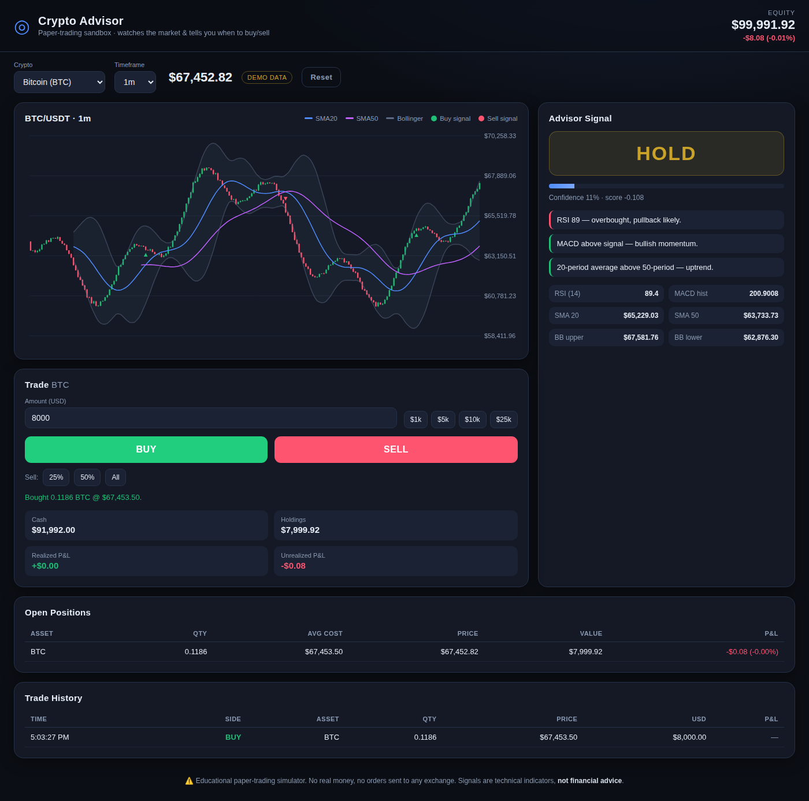

# Crypto Advisor 📈

A **local, paper-trading dashboard** that keeps an eye on crypto for you, tells
you when it thinks it's a good time to **buy** or **sell**, and lets you place
those trades yourself on a simple UI — all with **$100,000 of fake money** so
you can practice and see your profit/loss without risking a cent.

> ⚠️ **Educational simulator only.** No real money is used and no orders are
> ever sent to any exchange. The buy/sell signals are standard technical
> indicators — **not financial advice.**



## What it does

- **Pick a coin** (BTC, ETH, SOL, BNB, XRP, DOGE, ADA, AVAX) and a timeframe.
- **Live candlestick chart** with SMA(20), SMA(50) and Bollinger Bands drawn on
  top, plus ▲/▼ markers where buy/sell signals fired.
- **Advisor signal card** — a big **BUY / SELL / HOLD** call with a confidence
  score and plain-English reasons (RSI, MACD, Bollinger, trend).
- **Trade panel** — buy a dollar amount or sell 25% / 50% / all of a holding.
- **Portfolio tracking** — cash, holdings, realized & unrealized P&L, open
  positions and full trade history, starting from **$100,000**.
- **Reset** button to wipe the slate back to $100k anytime.

## How the signal works

Each refresh it recomputes a handful of classic indicators on the latest
candles and blends them into one weighted score from -1 (strong sell) to +1
(strong buy):

| Indicator | Bullish when… | Bearish when… |
|-----------|---------------|---------------|
| **RSI(14)** | below 30 (oversold) | above 70 (overbought) |
| **MACD(12,26,9)** | line crosses above signal | crosses below signal |
| **Bollinger(20,2)** | price at/under lower band | price at/over upper band |
| **Trend** | SMA20 above SMA50 | SMA20 below SMA50 |

`score ≥ +0.33 → BUY`, `score ≤ -0.33 → SELL`, otherwise `HOLD`.
Confidence is `|score| × 100`.

## Run it

**No installation, no API key, no dependencies** — just Python 3.8+ (it uses
only the standard library).

```bash
# from the repo root
python3 -m crypto_advisor
```

Then open **http://localhost:8000** in your browser.

Options:

```bash
python3 -m crypto_advisor --port 9000      # use a different port
python3 -m crypto_advisor --host 0.0.0.0   # expose on your network
```

## Data source

By default it pulls real candles from public exchange endpoints
(Binance, then Binance.US). **No account or API key is required** — these are
public market-data URLs.

If no exchange is reachable (offline, region-blocked, or a locked-down network)
it automatically switches to a **synthetic price generator** so the app still
runs and you can test the full buy/sell/P&L flow. The badge next to the price
shows **`live data`** or **`demo data`** so you always know which you're seeing.

## Project layout

```
crypto_advisor/
├── __main__.py     # entry point  (python3 -m crypto_advisor)
├── server.py       # stdlib HTTP server + JSON API
├── feed.py         # market data (live exchange + synthetic fallback)
├── indicators.py   # RSI / MACD / Bollinger / SMA / EMA + composite signal
├── portfolio.py    # paper portfolio: buy, sell, P&L, history
└── static/         # self-contained web UI (HTML + CSS + canvas chart, no CDN)
```

## API (if you want to script it)

| Method | Endpoint | Purpose |
|--------|----------|---------|
| `GET`  | `/api/symbols` | available coins & timeframes |
| `GET`  | `/api/snapshot?symbol=BTCUSDT&interval=1m` | candles + signal + portfolio |
| `POST` | `/api/buy` `{symbol, usd}` | buy a dollar amount |
| `POST` | `/api/sell` `{symbol, pct}` or `{symbol, usd}` | sell part/all of a holding |
| `POST` | `/api/reset` | reset paper balance to $100k |

The paper portfolio lives in memory and **resets when you restart** the server.
